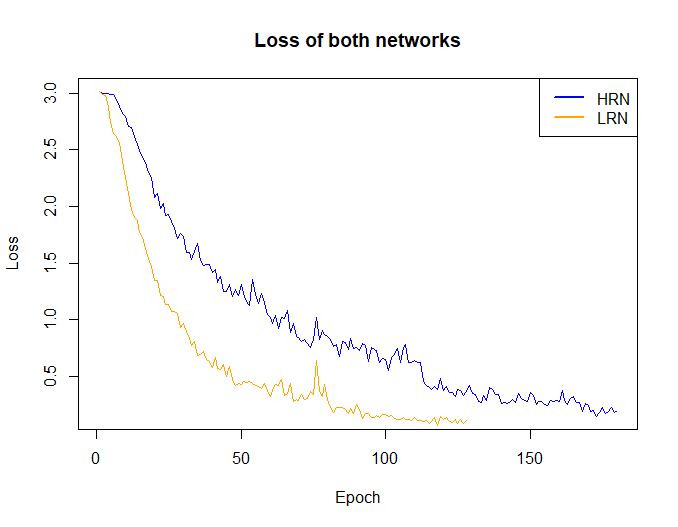

# 基于视觉的实时动态手势识别系统

## 简介

本项目为上海交通大学数字图像处理（CS386）课程大作业，由[王梓涵](https://github.com/wzh99)完成。

在本项目中构建了一个完整的基于视觉的实时动态手势识别系统，包括数据采集、模型训练与测试、实时预测等各个环节。

## 配置

### 环境

* Python 3.7

### 依赖

* Tensorflow 2.0.0
* Keras 2.3.1
* OpenCV 4.1.0
* pyrealsense 2.29.0
* NumPy 1.16.2
* scikit-learn 0.21.3
* Matplotlib 3.0.3
* Pandas 0.25.3
* h5py 2.10.0

通过 `pip install -r requirements.txt` 安装所有依赖。

如需使用 `tf.keras`，请将所有的 `import keras` 替换为 `from tensorflow import keras`。

## 运行

本项目的代码使用模块化与面向对象设计，主程序的代码均非常简短。建议直接在 IDE 中修改参数并运行，暂不支持通过命令行传递参数。

## 数据集

### 采集

在 [capture.py](capture.py) 指定数据集的存放位置：

```python
rec = Recorder(path="train_data")
```

运行以捕获手势样本。在指定目录下存储为 `${手势类别名}/${时间戳}/${通道标识}${帧编号}.jpg` 的形式，可直接观察样本的质量。手势样本制作为 GIF 如下：

深度图


梯度图：


### 封装

对采集的样本需要进行一定的预处理和封装，以加快训练时数据的加载效率。在 [load.py](load.py) 指定原始数据集目录和输出 HDF5 文件位置：

```python
x, y = from_directory("test_data")
_store_as_hdf5("test_data.h5", x, y)
```

运行以进行封装。

## 分类模型

### 模型定义

[model.py](model.py) 中定义了需要的分类模型，可自行根据需求定义。本项目中定义了三个模型：来自 [Molchanov et al.](https://research.nvidia.com/publication/hand-gesture-recognition-3d-convolutional-neural-networks) 的 HRN 和 LRN，以及来自 [Tran et al.](https://arxiv.org/abs/1412.0767) 的 C3D。添加定义后需要在 `network_spec` 字典中规定类型名和模型参数存储位置，如对于 HRN：

```python
"hrn": {
    "init": HRN,
    "path": "weights/hrn.h5"
},
```

### 训练

[train.py](train.py) 中定义了训练的程序，需要给定模型在 `model.network_spec` 中的键，封装后数据的位置，以及训练轮数：

```python
trainer = Trainer("hrn", "train_data.h5")
trainer.train(200)
```

运行以进行训练，训练过程中如要中断，按下回车键，即可在当前轮结束后停止。训练历史数据（损失与准确度等）存储在 `log/${模型名}.csv` 中，可供后续分析使用，如使用 RStudio 绘图：




### 测试

[test.py](test.py) 中可对训练完成的模型进行测试，测试数据建议另行采集。`ModelTester` 可取两个模型的结合结果，如果只需测试单个模型，则两个模型名保持相同即可。

```python
data_x, data_y = data.from_hdf5("test_data.h5")
tester = ModelTester("hrn", "lrn")
tester.test(data_x, data_y)
```

测试完成后，会输出准确率、运行时间及混淆矩阵。下面展示 HRN+LRN 在实验时的混淆矩阵：


### 可视化

[visual.py](visual.py) 可对训练完成的模型进行卷积层输出可视化。`Visualizer` 可对单个卷积层、单个手势类别的特定样本（默认第一个）输出可视化结果。结果存储为 `visual/${模型名}/${手势名}/l${卷积层序号}_f${帧序号}.jpg`

```python
 vis = Visualizer("lrn")
 for layer_idx in range(3):
 	vis.visualize(layer_idx, "train_data", 14)
```

上述代码可对 LRN 的三个卷积层对于“好的”（14 号手势）第一个样本分别输出可视化结果，单个图片中包含了该层的所有卷积核在该帧的输出，将输出图片制作为 GIF 如下：

层 0：


层 1：


层 2：


## 实时预测

手势实时预测和相关应用见 [recog.py](recog.py)。为了实现对于采集程序的重用，以及预测程序与手势应用的分离，采用了回调函数。手势应用开发者只需要继承 `GestureApp` 并实现 `on_gesture` 方法，在 `Recorder` 的构造函数中将该应用的对象传入即可。本项目中实现了简单的图片图片查看器 `ImageViewer` 作为 `GestureApp` 的示例。

```
m1, m2 = model.load_two_models("hrn", "lrn")
viewer = ImageViewer("demo")
rec = Recorder(callback=lambda seq: recogize_sample(m1, m2, seq, viewer))
viewer.start()
rec.record()
```

运行该程序即可体验。